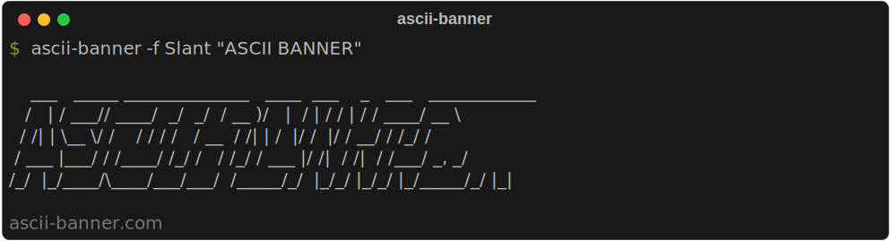
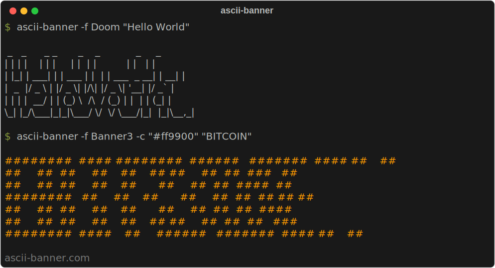
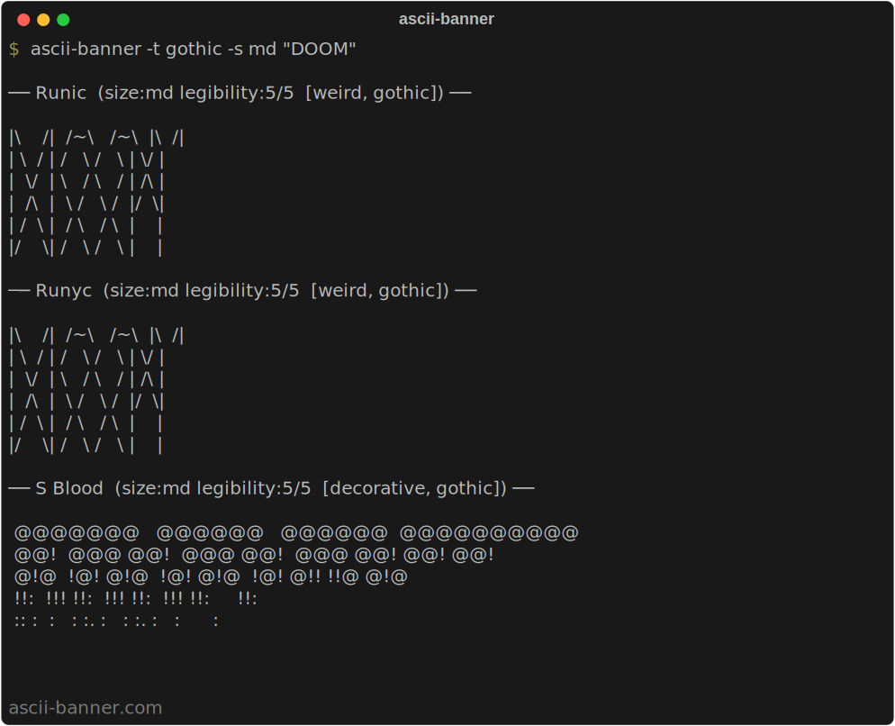
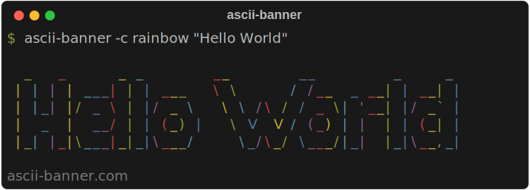
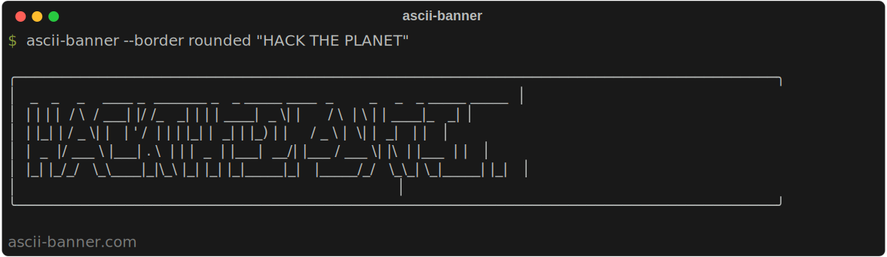
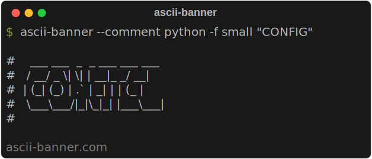

# ascii-banner



Convert text to ASCII art banners using FIGlet fonts. 328 built-in fonts, color output, borders, comment formatting, and fuzzy font search -- all with zero dependencies.

**Repository**: [github.com/nvk/ascii-banner](https://github.com/nvk/ascii-banner)

## Install

```bash
python -m venv .venv
source .venv/bin/activate
pip install -e .
```

## Quick Start

```bash
# Default font (standard)
ascii-banner "Hello"

# Pick a font
ascii-banner -f Doom "Hello"

# Pipe input
echo "Hello" | ascii-banner -f Big

# Color + border
ascii-banner -f Slant -c red --border rounded "Deploy"
```



## Fonts

328 bundled FIGlet fonts, each tagged with categories and rated for size (xs/sm/md/lg/xl) and legibility (1-5).

### Browse fonts

```bash
# List all fonts
ascii-banner list

# Filter by tag
ascii-banner list block

# Filter by size
ascii-banner list sm

# Preview fonts rendered in their own style
ascii-banner list --preview

# Show all available tags, sizes, and other options
ascii-banner tags
```

### Preview fonts with your text



```bash
# Show text in all fonts
ascii-banner --all "Test"

# Show text in fonts matching a tag
ascii-banner -t gothic "Test"

# Show text in fonts matching a size
ascii-banner -s xl "Test"

# Combine tag + size
ascii-banner -t block -s md "Test"

# Sort by legibility (highest first)
ascii-banner -t classic --sort legibility "Test"
```

### Category tags

| Tag | Description |
|---|---|
| `3d` | 3D effects, depth, perspective |
| `block` | Heavy block/box characters, filled shapes |
| `bubble` | Rounded, bubble-like characters |
| `classic` | Traditional FIGlet style |
| `cursive` | Script, handwriting, flowing |
| `decorative` | Ornamental, fancy, elaborate |
| `digital` | LED, LCD, dot matrix, pixel |
| `gothic` | Dark, medieval, blackletter |
| `graffiti` | Street art, urban style |
| `lean` | Thin, lightweight strokes |
| `mini` | Very small, compact (1-3 lines) |
| `mono` | Monospace, fixed-width terminal style |
| `sans` | Clean sans-serif letterforms |
| `serif` | Serif letterforms |
| `shadow` | Shadow effects |
| `slant` | Italic/slanted/oblique |
| `tech` | Futuristic, sci-fi, cyber |
| `weird` | Abstract, artistic, hard to read |

### Size classes

| Size | Height |
|---|---|
| `xs` | 1-3 lines |
| `sm` | 4-5 lines |
| `md` | 6-8 lines |
| `lg` | 9-12 lines |
| `xl` | 13+ lines |

## Colors

Apply color to output with `-c` / `--color`. Requires a terminal that supports ANSI escape codes.



```bash
# Named colors: black, red, green, yellow, blue, magenta, cyan, white
ascii-banner -c green "OK"

# Hex color
ascii-banner -c "#ff6600" "Fire"

# Rainbow (cycles per character)
ascii-banner -c rainbow "Party"

# Two-color gradient (horizontal)
ascii-banner -c gradient:red:blue "Fade"

# Gradient supports named colors, hex, and extra names: orange, pink, purple
ascii-banner -c gradient:#ff0000:#00ff00 "Xmas"

# Smooth rainbow gradient (full spectrum)
ascii-banner -c gradient:rainbow "Spectrum"
```

## Borders

Wrap output in a box with `--border`. Five styles available:



```bash
# Single line
ascii-banner --border single "Hi"
# ┌──────────────┐
# │  _   _ _     │
# │ | | | (_)    │
# │ | |_| |_     │
# │ |  _  | |    │
# │ |_| |_|_|    │
# └──────────────┘

# Double line
ascii-banner --border double "Hi"
# ╔══════════════╗
# ║  ...         ║
# ╚══════════════╝

# Rounded corners
ascii-banner --border rounded "Hi"
# ╭──────────────╮
# │  ...         │
# ╰──────────────╯

# Heavy/thick
ascii-banner --border heavy "Hi"
# ┏━━━━━━━━━━━━━━┓
# ┃  ...         ┃
# ┗━━━━━━━━━━━━━━┛

# ASCII (portable)
ascii-banner --border ascii "Hi"
# +----------------+
# |  ...           |
# +----------------+
```

## Comment Formatting

Wrap output as a source code comment with `--comment`. Useful for embedding banners in code.



```bash
# Python / Bash / Ruby / Perl
ascii-banner --comment python "api"
#    __ _ _ __  _
#   / _` | '_ \| |
#  | (_| | |_) | |
#   \__,_| .__/|_|
#         |_|

# JavaScript / TypeScript / Go / Rust / Java / C++
ascii-banner --comment js "api"
//    __ _ _ __  _
//   / _` | '_ \| |
//  | (_| | |_) | |
//   \__,_| .__/|_|
//         |_|

# C / CSS (block comment)
ascii-banner --comment c "api"
/*
 *    __ _ _ __  _
 *   / _` | '_ \| |
 *  | (_| | |_) | |
 *   \__,_| .__/|_|
 *         |_|
 */

# HTML / XML
ascii-banner --comment html "api"
<!--
     __ _ _ __  _
    / _` | '_ \| |
   | (_| | |_) | |
    \__,_| .__/|_|
          |_|
-->

# SQL / Lua / Haskell
ascii-banner --comment sql "api"
--    __ _ _ __  _
--   / _` | '_ \| |
--  | (_| | |_) | |
--   \__,_| .__/|_|
--         |_|
```

Supported languages: `bash`, `c`, `cpp`, `css`, `go`, `haskell`/`hs`, `html`, `java`, `javascript`/`js`, `lua`, `perl`, `python`, `ruby`, `rust`, `shell`/`sh`, `sql`, `typescript`/`ts`, `xml`.

## Fuzzy Search

Misspell a font name and ascii-banner will suggest the closest match:

```bash
$ ascii-banner -f stanard "Hi"
Font 'stanard' not found. Using 'Standard'.

$ ascii-banner -f blok "Hi"
Font 'blok' not found. Using 'Block'.
  Other matches: Blocks, Bloody
```

Fuzzy matching uses substring search, character sequence matching, and Levenshtein edit distance to find the best result.

## Suppress Output

```bash
# Flag: suppress all output
ascii-banner -q "hidden"
ascii-banner --quiet "hidden"

# Environment variable: suppress all output (any value except "" and "0")
NO_BANNER=1 ascii-banner "hidden"
```

Useful for conditionally disabling banners in scripts or CI.

## Full Flag Reference

| Flag | Short | Description |
|---|---|---|
| `text` | | Text to render (positional, or pipe via stdin) |
| `--font NAME` | `-f` | Font name (default: `standard`). Supports fuzzy matching |
| `--font-file PATH` | `-F` | Load a `.flf` font from a file path |
| `--all` | `-a` | Render text in all available fonts |
| `--tag TAG` | `-t` | Filter fonts by category tag |
| `--size SIZE` | `-s` | Filter fonts by size (`xs`, `sm`, `md`, `lg`, `xl`) |
| `--sort KEY` | | Sort multi-font output: `name`, `size`, `legibility` (default: `name`) |
| `--width N` | `-w` | Max output width (default: terminal width) |
| `--color COLOR` | `-c` | Color: name, `#hex`, `rainbow`, `gradient:c1:c2`, `gradient:rainbow` |
| `--justify ALIGN` | `-j` | Justification: `left`, `center`, `right` (default: `left`) |
| `--border STYLE` | | Border box: `single`, `double`, `rounded`, `heavy`, `ascii` |
| `--comment LANG` | | Wrap as code comment for the given language |
| `--quiet` | `-q` | Suppress all output |

### Subcommands

| Command | Description |
|---|---|
| `ascii-banner list` | List all fonts with size and legibility info |
| `ascii-banner list <tag\|size>` | List fonts filtered by tag or size class |
| `ascii-banner list --preview` | List fonts with a rendered preview |
| `ascii-banner tags` | Show all tags, sizes, border styles, and comment formats |

## License

MIT + Commons Clause -- Copyright (c) 2026 nvk

Bundled FIGlet font files (`.flf`) retain their original licenses as specified in each font's comment header.
